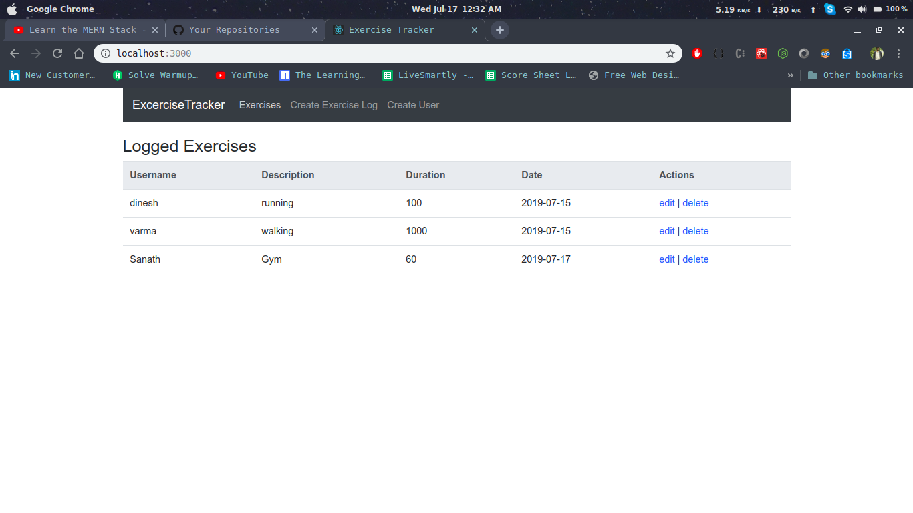
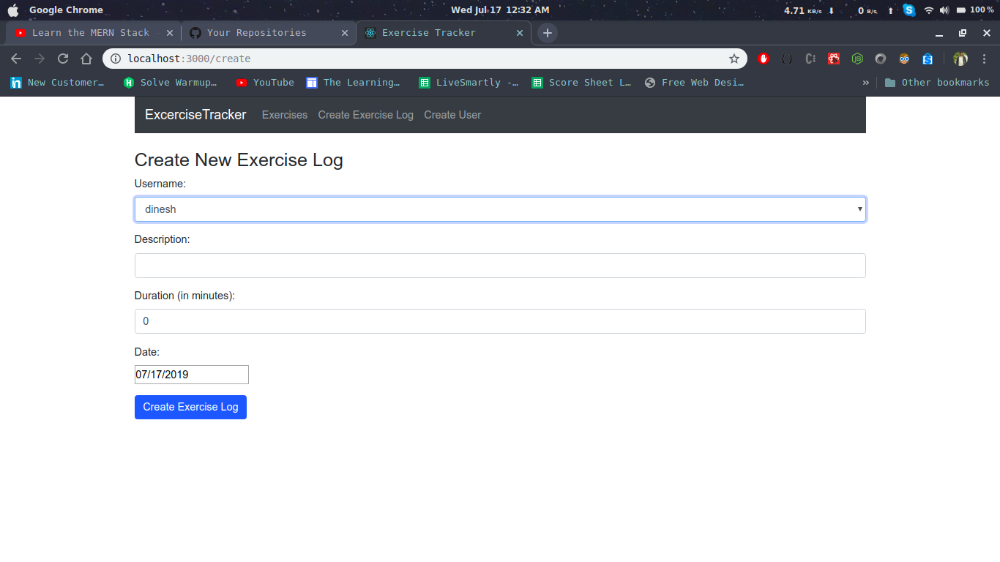

# User Exercise Tracker using MERN stack

You need to have mongodb installed first and any Local Database to see your data

git clone https://github.com/dineshnadimpalli/Exercise-Tracker-using-MERN-stack.git

#Go to the React folder

  cd Exercise-Tracker-using-MERN-stack

  npm i
  
  npm start

The frontend will now automatically run on port http://localhost:3000

#Now start the MongoDB using

  mongod --dbpath <relatve path of the Database folder in the project folder>
  

#Now go to the backend folder in the same project folder

  cd backend
  
  npm i
  
  nodemon server (or) npm start
  
Now, the server will run on port 8000

Here are the sample pictures of how the app should look once you successfully clone it and run.

  

  

  

